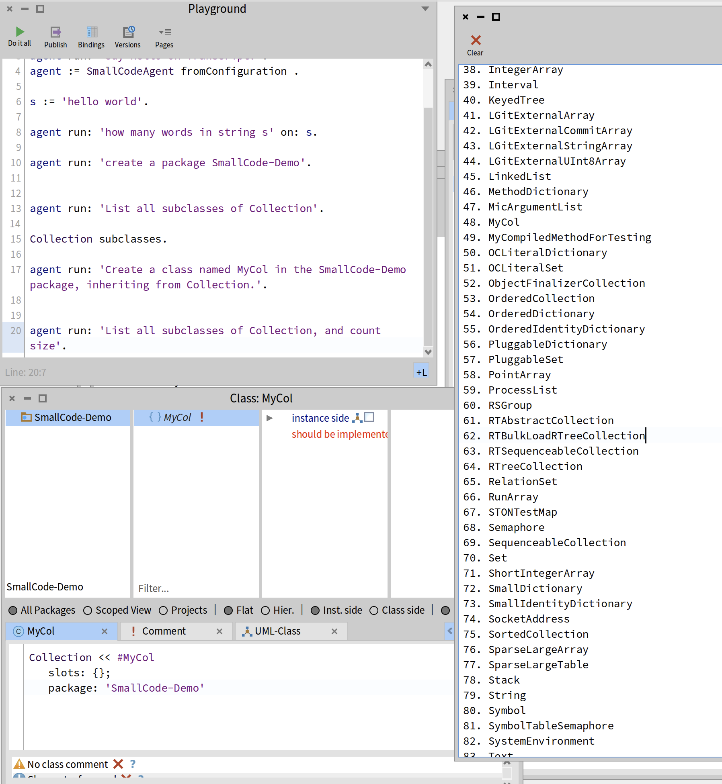
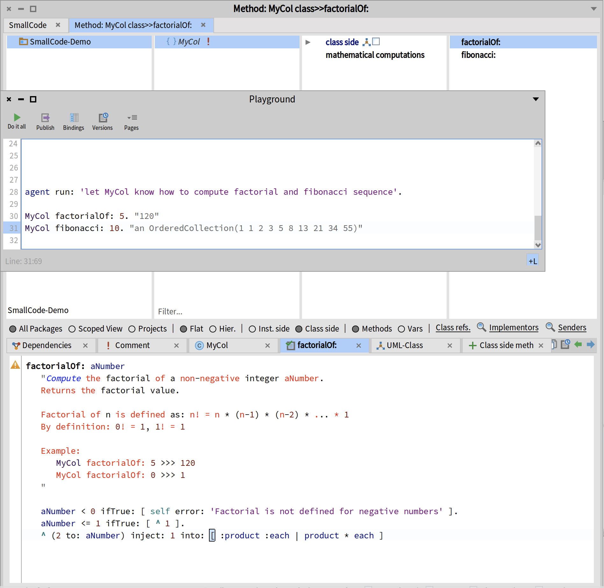

# Coding Agent in Pharo Smalltalk

Author: Han Zhupeng (hanzhupeng@gmail.com)  aka. AlbertLee

## Why Smalltalk

why not? If you know Debugger and inspector, you'll realize that the Smalltalk Image is the perfect fit for a Coding Agent.

More details:
[Why Smalltalk Coding Agent](docs/why-smalltalk-agent.md)

## Intro

[](https://www.bilibili.com/video/BV1GKjL6GESJ/)


## Project Status

The proof-of-concept stage can already autonomously generate and run code, and inspect Pharo image contents, but it has not yet been tuned.



The generated code is still somewhat clumsy and does not leverage existing methods:


## Install and run.

### Install packages:

1. Git clone the project to local directory.
2. open "Git Repositories Browser" tool.
3. Import from existing clone, locate to the project's local directory .
4. Load all packages in the repo.

### Configure the LLM Provider

Using Openrouter. open Playground and run:

```
SmallCodeConfiguration current apiKey: 'sk-or-YOUR-KEY'.
SmallCodeConfiguration current baseURL: 'https://openrouter.ai/api/v1'.

SmallCodeConfiguration current model: '<one you like and can afford>'. 
```

### Run

Open Transcript window. Run code in Playground window:

```
agent := SmallCodeAgent fromConfiguration .

agent run: 'Say hello on Transcript.'.

s := 'hello world this is a coding agent in smalltalk'.

agent run: 'how many words in string s' on: s.

agent run: 'create a package SmallCode-Demo'.

agent run: 'List all direct subclasses of Collection'.

agent run: 'Create a class named MyCol in the SmallCode-Demo package, inheriting from Collection.'.

agent run: 'List all direct subclasses of Collection, and count size'.

agent run: 'let MyCol know how to compute factorial and fibonacci sequence'.

MyCol factorialOf: 5.
MyCol fibonacci: 10.

```
